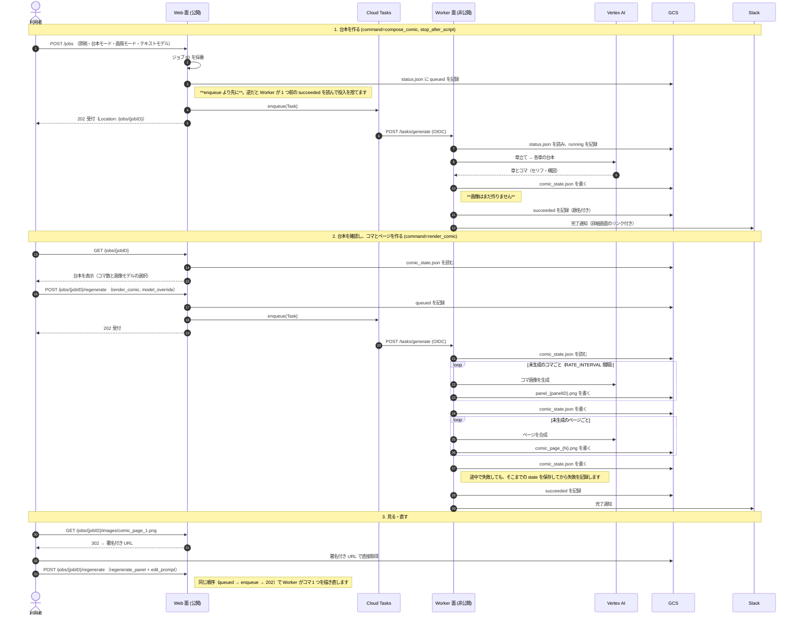

# 🎨 AP Story

[](https://github.com/shouni/ap-story/actions/workflows/ci.yml)
[](#)
[](https://go.dev/)
[](https://cloud.google.com/run)
[](https://opensource.org/licenses/MIT)

## 🚀 概要 (About) - 台本を確認してから、コマとページに絵を入れる

**AP Story** は、原稿から漫画を生成する Cloud Run + Cloud Tasks 上のサービスです。

原稿（URL またはテキスト）を読み込み、[go-comic-kit](https://github.com/shouni/go-comic-kit) の
操作で「章立て → ネーム（台本）→ コマ画像 → ページ画像」を非同期ジョブとして生成します。
成果物と状態ドキュメント（`comic_state.json`）は GCS に置き、ジョブの進行状況
（`queued` / `running` / `succeeded` / `failed`）は同じプレフィックスの `status.json` に記録します。

* **台本と画像は別の工程です。** Web フォームは章立てとネームまでを作り、画像の生成は作品詳細で
  コマ数を見てから始めます。
* **途中から再開できます。** state は工程の切れ目ごとに保存され、`render_comic` は未生成の
  コマ・ページだけを埋めます。
* **コマ・ページを個別に直せます。** シードの振り直しと編集指示（「表情を笑顔に」）を
  ジョブとして投入します。
* **台本のセリフは画面と API から直せます。** 直したセリフは、対象ページを合成し直すと絵に載ります。
* **人と機械が同じ URL を使います。** ブラウザは Google OAuth のセッション、AI エージェントは
  サービスアカウントの OIDC（M2M）で、同じルートを `Accept` と本文の形で使い分けます。
  同じ API を MCP ゲートウェイ経由でも呼び出せます。

1つのイメージを `SERVER_ROLE` で **Web 面（公開）と Worker 面（非公開）の2サービス**として
デプロイします（`cloudbuild.yaml`）。

---

## 📦 使い方

### 1. 環境設定

`ValidateEssentialConfig` はロールごとに必要なものだけを検証します。

**どのロールでも必須**

| 変数名 | 説明 |
| --- | --- |
| `SERVER_ROLE` | `web` / `worker` / `both`（`both` はローカル開発用）。**未設定・未知の値は起動時エラー**です。担当する面だけを組み立て、ルートもその面のものだけを登録します。 |
| `GCP_PROJECT_ID` | GCP Project ID。Gemini は Vertex AI 経由で呼びます。ローカル実行では ADC が必要です。 |
| `GCP_LOCATION_ID` | Cloud Tasks キューのリージョン（例: `asia-northeast1`）。既定値は無く、未設定なら起動時にエラーになります。 |
| `STORY_BUCKET` | 成果物・state・進行状況を置く GCS バケット**名**（`gs://` は付けません。付いていれば外します）。 |

**Web 面（`web` / `both`）で必須**

| 変数名 | 説明 |
| --- | --- |
| `GEMINI_MODELS` | 台本（章立て・章台本）のモデル。**カンマ区切りで先頭が既定**、一覧がフォームの選択肢と投入時の許可リストになります。既定値は持ちません。worker は読みません（ジョブが自分のモデル名を運びます）。 |
| `IMAGE_MODELS` | 画像（デザインシート・コマ・ページ）のモデル。扱いは `GEMINI_MODELS` と同じです。 |
| `CLOUD_TASKS_QUEUE_ID` | 投入先のキュー名。 |
| `WORKER_URL` | worker **サービス**の URL。パスは含めません。 |
| `TASK_CALLER_SERVICE_ACCOUNT_EMAIL` | タスクに載せる caller SA。**トークンを発行するのは Cloud Tasks** であって、このプロセスが署名するわけではありません。 |
| `GOOGLE_CLIENT_ID` / `GOOGLE_CLIENT_SECRET` | Google OAuth のクライアント。 |
| `SESSION_FIRESTORE_DATABASE` / `SESSION_FIRESTORE_COLLECTION` | セッションを置く Firestore（既定はどちらも `sessions`）。Firestore はセッションにだけ使い、ジョブの進行状況は GCS にあります。 |
| `ALLOWED_EMAILS` / `ALLOWED_DOMAINS` | ログインを許可する相手（カンマ区切り）。**どちらも空だと起動しません。** |
| `ALLOWED_M2M_SERVICE_ACCOUNTS` | 機械（MCP ゲートウェイなど）が OIDC Bearer で叩くときに許可する SA（カンマ区切り）。空だと起動しません。 |

**Worker 面（`worker` / `both`）で必須**

| 変数名 | 説明 |
| --- | --- |
| `TASK_AUDIENCE_URL` | OIDC 検証の audience。未設定なら `SERVICE_URL` を使います。web/worker を分けた場合は**呼び先である worker の URL** です。 |
| `ALLOWED_TASK_SERVICE_ACCOUNTS` | 受け付ける caller SA（カンマ区切り）。**投入側**の SA を指定します。web/worker で実行 SA を分けるため、worker には「他人の SA」が並びます。 |
| `TASK_DISPATCH_DEADLINE` | Cloud Tasks がワーカーの応答を待つ上限（例: `30m`。Cloud Tasks の上限も `30m`）。**既定値は無く、未設定だと起動時に落ちます。** |
| `PIPELINE_TIMEOUT` | ワーカータスク1件（台本→コマ→ページの工程列全体）の上限。**既定値は無く、未設定・無制限・`TASK_DISPATCH_DEADLINE` 以上のいずれも起動時に拒否されます。** |

worker の実行時間を決める値は 3 つあり、この大小関係を守ります。実効上限は**いちばん小さい値**です。

```
PIPELINE_TIMEOUT  <  TASK_DISPATCH_DEADLINE  <=  Cloud Run の timeout
    (アプリ)              (タスク)                  (サービス)
```

3 つともアプリ側に既定値は無く、値を決めるのはインフラ側の Terraform だけです。

**任意**

| 変数名 | 説明 |
| --- | --- |
| `SERVICE_URL` / `PORT` | 公開 URL と待ち受けポート (Default: `http://localhost:8080` / `8080`)。`SERVICE_URL` は OAuth のリダイレクト先・M2M 認証の audience・Slack 通知リンクの生成元を兼ねるため、**worker にも web の URL** を設定します。 |
| `CHARACTERS_JSON_PATH` | go-character-kit の `characters.json`（GCS またはローカル）。未設定なら go-character-kit 埋め込みの既定キャラクター定義を使います。 |
| `IMAGE_ASPECT_RATIO` | コマ・ページ・デザインシート共通の比率（`1:1` / `3:4` / `9:16` / `16:9`）。未設定なら `3:4`。 |
| `PANEL_IMAGE_SIZE` / `PAGE_IMAGE_SIZE` | 生成画像の解像度（`1K` / `2K`）。未設定ならコマ `1K`、ページ・シート `2K`。 |
| `MAX_CHAPTERS` / `MAX_PANELS_PER_CHAPTER` / `MAX_PANELS_PER_PAGE` | 章数・章あたりのコマ数・ページあたりのコマ数の上限。未設定なら go-comic-kit の既定。 |
| `MAX_CONCURRENCY` | 一括生成の並列数（既定 `1` = 逐次）。 |
| `RATE_INTERVAL` | AI 呼び出しの発射間隔の下限 (Default: `10s`、`0` で無制限)。**スループット上限は `MAX_CONCURRENCY` ではなく 1/`RATE_INTERVAL` で決まります。** `compose_comic` は既定値で最大 84 回の AI 呼び出しになり、`10s` でも下限 14 分なので、上げるときは上の 3 段に収まるかを先に確認してください。 |
| `REQUEST_TIMEOUT` | 外部 AI 呼び出し1回あたりの上限 (Default: `5m`)。画像生成1枚に数十秒かかるため、`2m` を下回ると起動時に警告が出ます。 |
| `SLACK_WEBHOOK_URL` | 完了・失敗の通知先。未設定なら通知は無効になります。worker 面だけが使います。 |

> 環境変数が持つのは**デプロイ先が決める設定**だけです。原稿・モード・モデルといった
> 作品ごとに変わる値は、タスクのペイロード（JSON）で渡し、`comic_state.json` に記録されます。

### 2. 起動

```bash
go run .        # SERVER_ROLE が必須
```

`SERVER_ROLE` が担う面だけを組み立てます。

| ロール | 組み立てるもの | 公開されるルート |
| --- | --- | --- |
| `web` | 投入フォーム・作品とキャラクターの画面・Cloud Tasks への投入・セッション用 Firestore | `/`, `/compose/*`, `/comic-options`, `/jobs/*`, `/characters/*`, `/auth/*` |
| `worker` | パイプライン（go-comic-kit + Vertex AI + GCS + 通知） | `POST /tasks/generate` |
| `both` | 両方（ローカル開発用） | 上記すべて |

本番では 1 つのイメージを 2 つの Cloud Run サービスとしてデプロイします（`cloudbuild.yaml`）。
worker は ingress を `internal` にして到達経路を Cloud Tasks に限定し、実行 SA も web と分けます。
SA と IAM の定義はインフラ側の Terraform にあります。

`SERVER_ROLE=both` で `go run .` すると画面は確認できますが、**Cloud Tasks は localhost へ
配送できないため、投入してもワーカーは動きません。** ロジックの確認は `go test ./... -race` で行ってください。

### 3. HTTP エンドポイント

**認証は 1 つです。** `auth.Protected` が OIDC の Bearer とセッションの両方を通すため、
同じ URL を人も機械も叩けます。`GET /health` と `/static/*` だけが認証の外側で、
ロールに関係なく登録されます。

| メソッド | パス | 用途 |
| --- | --- | --- |
| `GET` | `/health` | ヘルスチェック（`/healthz` は Cloud Run の既定ドメイン側で予約パス扱いになりコンテナまで届かないため使いません）。認証不要 |
| `GET` | `/static/*` | 埋め込みの CSS / JS と `vendor/` 配下の Bootstrap / Bootstrap Icons。認証不要。`vendor/` は `public, max-age=31536000, immutable`、自前アセットは `public, max-age=300, must-revalidate` |
| `GET` | `/auth/login` `/auth/callback` `/auth/logout` | Google OAuth のログイン・コールバック・ログアウト |
| `GET` | `/` | Home 画面（直近の作品を数件表示） |
| `GET` | `/compose` | 台本生成フォーム。台本モード・画風モード・テキストモデルを選びます。**画像モデルは作品詳細で選びます** |
| `GET` | `/compose/design-sheet` | デザインシート単体生成フォーム。`?character_id=` で事前選択できます |
| `GET` | `/comic-options` | 生成ジョブに指定できる台本モード・画風モード（用途の説明付き）とモデル一覧（先頭が既定）。投入時の許可リストそのもので、フォームの `<select>` と同じ内容 |
| `POST` | `/jobs` | ジョブを投入。本文がフォームなら画面、JSON なら機械です。`command` は `compose_comic`（省略時）か `generate_design_sheet`。ジョブ ID はサーバーが採番します。受付は `202` と `Location: /jobs/{jobID}` |
| `GET` | `/jobs` | 作品（`compose_comic` のジョブ）を新しい順に。`?page=`（1 ページ 20 件）。ブラウザには一覧画面、`Accept: application/json` には state の列挙 |
| `GET` | `/jobs/{jobID}` | ジョブ 1 件。投入から削除まで同じ URL です。ブラウザには詳細画面（コマ・ページの生成ボタン、台本タブ、個別の再生成）。JSON には進行状況と、state が読めれば `comic` に `comic_state.json` の内容。デザインシートのジョブは進行状況だけです |
| `DELETE` | `/jobs/{jobID}` | 成果物をまとめて削除（`204`）。画面の削除ボタンも fetch で DELETE を送ります |
| `GET` | `/jobs/{jobID}/script` | 台本のうち編集できる部分（章の見出しと各コマのセリフ）だけを返します。生成記録やプロンプトは含みません |
| `PUT` | `/jobs/{jobID}/script` | 台本の保存。差し替えられるのはセリフの文面・話者・種別だけで、**コマの追加・削除・並べ替えは拒否します。** 合成し直すべきページを `affected_pages` で返します。ジョブが `queued` / `running` の間は `409` |
| `POST` | `/jobs/{jobID}/regenerate` | 再生成ジョブの投入（`compose_comic` 以外の `command` とパラメータ）。`job_id` は URL のものを使い、本文の値は無視します。`202` と `Location` |
| `GET` | `/jobs/{jobID}/images/*` | コマ・ページ画像への署名付き URL リダイレクト（302） |
| `GET` | `/characters` | キャラクター一覧。ブラウザにはマスター参照画像のサムネイル付き、JSON には id・name・reference_url（画像 URL は `gs://` のまま） |
| `GET` | `/characters/{characterID}` | キャラクター詳細。ブラウザにはサイズ / アスペクト比ごとのマスター参照画像と、デザインシート生成履歴の最新 12 件。JSON には生成履歴の全件（新しい順） |
| `GET` | `/characters/{characterID}/design-sheets` | デザインシート生成履歴の全件表示（新しい順、削除ボタン付き） |
| `DELETE` | `/characters/{characterID}/design-sheets/{jobID}` | デザインシート生成履歴 1 件の削除。単体生成ジョブなら state も削除、作品ジョブは state 内の参照だけを除きます |
| `GET` | `/characters/images/*` | デザインシート生成履歴の画像への署名付き URL リダイレクト |
| `GET` | `/characters/reference/*` | キャラクターのマスター参照画像への署名付き URL リダイレクト |
| `POST` | `/tasks/generate` | Cloud Tasks 専用のワーカー。OIDC 検証を通らないリクエストは 401、`SERVER_ROLE=web` では**ルートごと登録されない**ため 404 |

**同じリソースはルートも 1 本です。** 表現は `Accept` で決まり、`application/json` を送れば
JSON が、ブラウザの `Accept` なら画面が返ります。パスの切り方は public-docs の URL 命名規約に従います。

**副作用のあるメソッドには CSRF トークンが要ります。** フォームは `csrf_token` の hidden で、
画面の JS は `X-CSRF-Token` ヘッダーで送ります。OIDC Bearer で認証した機械はこの検証に入らず、
代わりに `ALLOWED_M2M_SERVICE_ACCOUNTS` で呼び出し元を絞ります。

台本モード・画風モード・モデルの検証（`GET /comic-options` の一覧に無い値は 400）は、
画面も API も同じ関数を通ります。

**画面での生成の進め方**

1. `/compose` で原稿を投入し、台本モード・画風モード・テキストモデルを選んで「台本を生成」。
   **このフォームは章立てとネームまでしか作りません**（`stop_after_script` が常に付きます）。
2. `/jobs/{jobID}` で台本を確認し、**画像モデルを選んで「コマを生成」**。作品全体でも、章カードから
   1 章だけでも始められます。途中で失敗しても「続きのコマを生成」が未生成分だけを埋めます。
3. コマが揃うと、同じ場所のボタンが「ページを合成」に変わります。
4. 気に入らないコマ・ページは詳細画面から個別に直します。シャッフル（`bi-shuffle`）はシードを
   振り直し、鉛筆（`bi-pencil`）は指示で部分編集します（生成済み画像が入力になるため、未生成の
   コマには表示されません）。章見出しの「台本を再生成」はその章のネームだけを作り直します
   （コマは作り直しになります）。
5. セリフの手直しは「台本」タブで行います。保存すると合成し直すべきページ番号が返るので、
   そのページを「ページを合成」で作り直します。

### 4. タスクのペイロード

Worker が受けるタスクは `command` で分岐します。各コマンドは「state をロード →
go-comic-kit の操作を実行 → state を保存」の形で、`render_comic` は生成済みのコマ・ページを飛ばします。

| `command` | 何をするか | 必須フィールド |
| --- | --- | --- |
| `compose_comic` | 章立て → 各章の台本 → 全コマ → 全ページ。`stop_after_script` で台本までで止まる。デザインシートは含まない | `source_url` または `source_text` |
| `render_comic` | 未生成のコマ・ページだけを生成。台本確認後の続行と、失敗・打ち切りからの再開を兼ねる。`chapter_id` でその章だけ、`stop_after_panels` でコマまでに絞れる | `job_id` |
| `regenerate_chapter_script` | 1 章の台本を作り直す（後続のコマ・ページは別途再生成） | `job_id`, `chapter_id` |
| `generate_design_sheet` | キャラクターデザインシートを生成 | `character_ids` |
| `regenerate_panel` | コマ 1 つを生成 / 再生成 | `job_id`, `panel_id` |
| `regenerate_page` | ページ 1 つを合成 / 再合成 | `job_id`, `page` |

| フィールド | 説明 |
| --- | --- |
| `command` | 上の 6 つのいずれか。`POST /jobs` は `compose_comic`（省略可）と `generate_design_sheet`、`POST /jobs/{jobID}/regenerate` はそれ以外を受け付けます。 |
| `job_id` | ジョブの識別子。`POST /jobs` ではサーバーが採番し、`regenerate` では URL のものを使います。成果物の置き場もこれで決まります。 |
| `source_url` / `source_text` | `compose_comic` の原稿。どちらか 1 つ。 |
| `script_mode` / `style_mode` | 台本モード（`assets/prompts/outline`・`chapter` の `.md`、ファイル名がモード名）と画風モード（`assets/prompts/styles.json`）。一覧は `GET /comic-options`。 |
| `text_model` | 台本を書くモデル。空なら `GEMINI_MODELS` の先頭。`POST /jobs` の JSON では `image_model` も受け付け、タスクの `model_override` になります。 |
| `model_override` | コマ・ページ・デザインシートを描くモデル。空なら `IMAGE_MODELS` の先頭。**最初の画像生成で作品に記録され、以降は既定になります。** |
| `stop_after_script` / `stop_after_panels` | 台本まで / コマまでで止める。フォームからの `compose_comic` は常に前者が付きます。 |
| `chapter_id` / `panel_id` / `page` | 対象の章（`ch01`）/ コマ（`ch01-p03`）/ ページ番号（1 始まり）。 |
| `character_ids`, `aspect_ratio`, `layout`, `reference_url_override`, `visual_cues_override` | `generate_design_sheet` の入力。`aspect_ratio` の既定は `16:9`。上書き 2 つは単一キャラクター指定時だけ効きます。 |
| `seed` / `edit_prompt` / `prompt_override` | `regenerate_panel` / `regenerate_page` / `generate_design_sheet` の生成条件。`seed` を省くと前回の生成条件を再利用し、`edit_prompt` を付けると生成済み画像を入力にした編集になります。 |

台本モード・画風モード・モデルの選択は `comic_state.json` に記録され、**あとから走らせるジョブが
引き継ぎます。** 台本確認後の `render_comic`、章の台本の作り直し、コマ・ページの再生成はいずれも
記録された選択を使うため、1 つの作品が途中から別のモデル・別の画風になることはありません。

```json
{
  "command": "compose_comic",
  "source_url": "https://example.com/story",
  "script_mode": "default",
  "style_mode": "default",
  "text_model": "<GEMINI_MODELS のいずれか>",
  "image_model": "<IMAGE_MODELS のいずれか>",
  "stop_after_script": true
}
```

```json
{
  "command": "regenerate_panel",
  "panel_id": "ch01-p03",
  "edit_prompt": "表情を笑顔にする"
}
```

**GCS レイアウト**

```
gs://{STORY_BUCKET}/
├── comics/{jobID}/                    # 作品ジョブごとのプレフィックス
│   ├── comic_state.json               # MangaState（履歴・詳細はこれを読む）
│   ├── status.json                    # 進行状況（queued / running / succeeded / failed）
│   └── images/
│       ├── panel_{panelID}.png        # コマ画像（コマ ID に紐づく安定パス・上書き）
│       └── comic_page_{N}.png         # ページ画像
├── design-jobs/{jobID}/
│   └── comic_state.json               # デザインシート単体生成ジョブの state（画像は character/ 側）
├── character/{tag}/{jobID}.png        # デザインシート（作品に依存しない共有アセット）
└── character-reference/{characterID}/... # 人手で用意したマスター参照画像
```

`{tag}` はキャラクター ID（合成シートの場合は複数 ID の連結）、`{jobID}` は生成呼び出しごとに
一意なので、同じキャラクターへの再生成が過去の結果を上書きしません。履歴一覧は
`comics/*/comic_state.json` の列挙で、デザインシート単体生成ジョブは `/characters/{characterID}` 側に
現れます。画像はアプリから直接配信せず、署名付き URL へ 302 リダイレクトします。

---

## 🔄 処理シーケンス図



## 🌳 プロジェクト構成ツリー図

```text
ap-story/
├── main.go                  # エントリポイント（サーバー起動）
├── Dockerfile               # scratch イメージ（静的バイナリのみ）
├── cloudbuild.yaml          # ビルドして2サービスへデプロイ
├── assets/                  # 埋め込み（prompts/outline・chapter の *.md、prompts/styles.json、templates/*.html、static/）
└── internal/
    ├── config/              # 環境変数の読み込みとロール別検証
    ├── server/              # chi ルーター・グレースフルシャットダウン
    │   └── handlers/        #   Web 面（投入フォーム・作品とキャラクターの画面・台本の編集・画像のリダイレクト）
    ├── domain/              # Task と command・ジョブ ID・進行状況・ポート定義（Pipeline / TaskQueue / ComicRepository / Notifier / JobStatusStore）
    ├── app/                 # DI コンテナ
    ├── builder/             # 外部依存とハンドラーの組み立て（ロール別）
    ├── repository/          # comic_state.json と status.json の読み書き・履歴一覧・削除
    ├── pipeline/            # ワーカー本体。pipeline.go の Runner が Lifecycle を組み、planner.go が command から工程列を決め、各工程は step_*.go
    └── adapters/            # go-comic-kit の Operations / Cloud Tasks / Slack / characters.json / プロンプト（prompts/）
```

---

## 📜 ライセンス (License)

* このプロジェクトは [MIT License](https://opensource.org/licenses/MIT) の下で公開されています。
